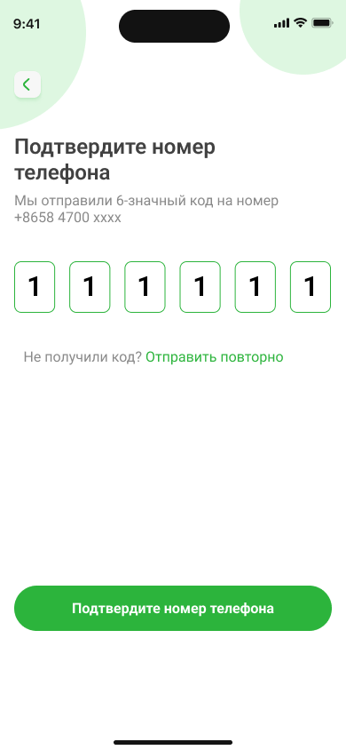

# Регистрация в Nova Bank

В Nova Bank можно зарегистрироваться по электронной почте и номеру телефона.

## Регистрация

1. При первом запуске приложения вы увидите приветственный экран. Чтобы начать регистрацию, пролистайте его и нажмите кнопку **Регистрация**.
2. Заполните личные данные: **Имя**,**Телефон**, (**Email** - необязательное поле).
3. Установите пароль.
>[!IMPORTANT]
>Пароль должен содержать от 6 до 20 символов (буквы латинского алфавита, цифры или допустимые символы).  
Допустимые символы: точка (.), символ «собака» (@), дефис (-) и подчеркивание (_).  
Пароль не должен содержать пробелов.
4. Поставьте галочку, чтобы подтвердить согласие с условиями сервиса.
5. Нажмите кнопку **Зарегистрироваться**.  

6. В появившемся блоке подтверждения номера телефона нажмите кнопку **Подтвердить**.  

7. Введите полученный код и нажмите **Подтвердить**.  

  

8. В появившемся окне нажмите **Перейти в приложение**.  
  

После успешной регистрации вы сможете войти в личный кабинет, используя номер телефона или электронную почту вместе с установленным паролем.

# Авторизация через Госуслуги в Nova Bank

Вы можете авторизоваться в Nova Bank через Госуслуги:

1. Нажмите на иконку Nova Bank на главном экране вашего устройства.
2. Выберите **Войти в аккаунт**.
3. Нажмите на значок меню и выберите **Госуслуги**.
4. Введите свои учётные данные для Госуслуг и проверьте их актуальность.
5. Нажмите **Войти**.
6. На ваш номер придёт SMS с кодом подтверждения.
7. Введите код и нажмите **Продолжить**.
8. При необходимости введите пароль от вашего аккаунта или подтвердите вход через push-уведомление.
9. Нажмите **Продолжить** для завершения авторизации.

После регистрации вы можете: [настроить аккаунт](../settings/Account.mdx), выполнить настройку pin-кода.

**Читайте также:**

- [Как перевести деньги по номеру карты](../payments/transfers.mdx)
- [Просмотр баланса и транзакций](../payments/balance.mdx) 
- [Как восстановить пароль в Nova Bank](../registration/change-password.mdx)
